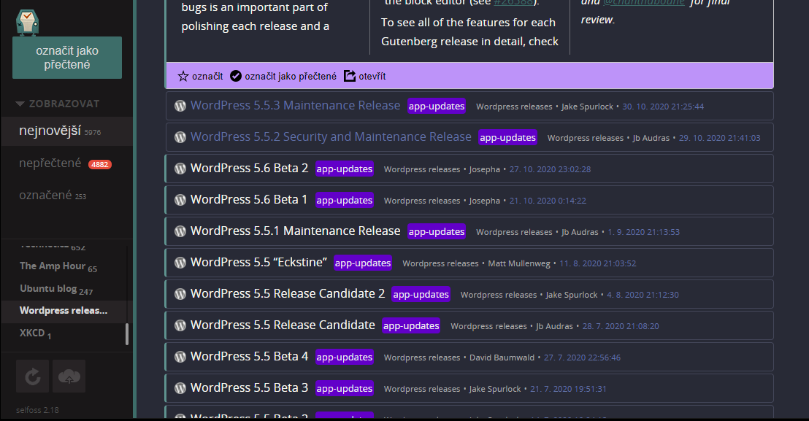

# Dracula for [selfoss](https://selfoss.aditu.de/)

> A dark theme for [selfoss](https://selfoss.aditu.de/).

I haven't submitted it to the [dracula repository](https://github.com/dracula/dracula-theme) yet, first I need to make sure it works properly.

## Install

All instructions can be found in the INSTALL.md file.

## Team

This theme is maintained by the following person(s) and a bunch of [awesome contributors](https://github.com/ondras12345/dracula-selfoss/graphs/contributors).

 |
--- |
[ondras12345](https://github.com/ondras12345) |

## License

[MIT License](./LICENSE)
